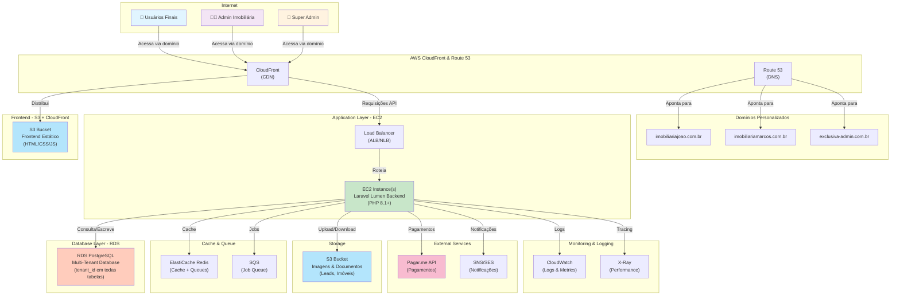
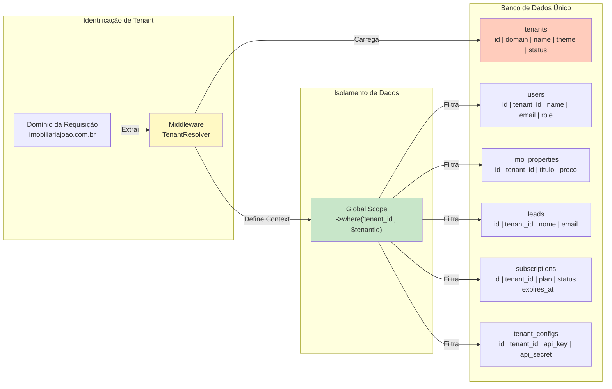
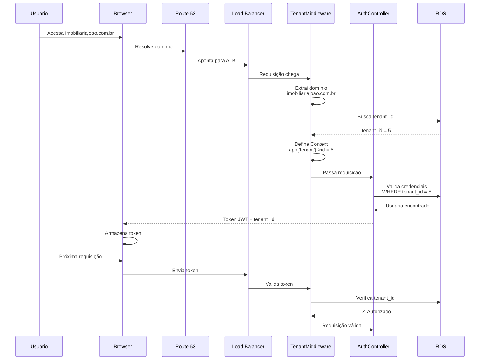
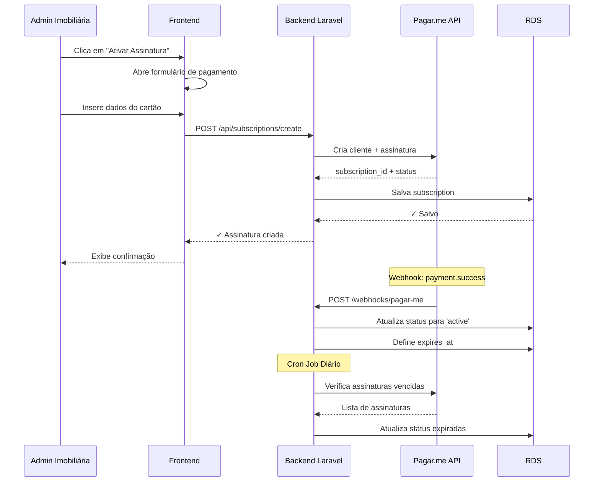
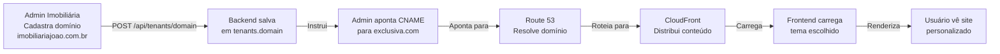
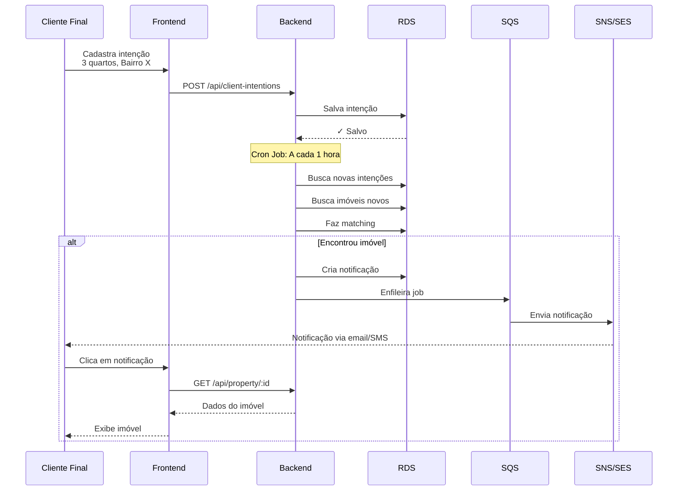

# Arquitetura SaaS - Exclusiva Lar

## Diagrama de Infraestrutura AWS



---

## Arquitetura Multi-Tenant



---

## Fluxo de Autenticação Multi-Tenant



---

## Estrutura de Tabelas Multi-Tenant

### Tabela: tenants
```sql
CREATE TABLE tenants (
    id BIGINT PRIMARY KEY AUTO_INCREMENT,
    domain VARCHAR(255) UNIQUE NOT NULL,
    name VARCHAR(255) NOT NULL,
    theme ENUM('classico', 'bauhaus') DEFAULT 'classico',
    subscription_status ENUM('active', 'inactive', 'suspended') DEFAULT 'inactive',
    subscription_plan VARCHAR(50),
    subscription_expires_at TIMESTAMP,
    pagar_me_customer_id VARCHAR(255),
    pagar_me_subscription_id VARCHAR(255),
    api_key VARCHAR(255),
    api_secret VARCHAR(255),
    created_at TIMESTAMP DEFAULT CURRENT_TIMESTAMP,
    updated_at TIMESTAMP DEFAULT CURRENT_TIMESTAMP ON UPDATE CURRENT_TIMESTAMP
);
```

### Tabela: users (modificada)
```sql
ALTER TABLE users ADD COLUMN tenant_id BIGINT NOT NULL AFTER id;
ALTER TABLE users ADD FOREIGN KEY (tenant_id) REFERENCES tenants(id) ON DELETE CASCADE;
ALTER TABLE users ADD COLUMN role ENUM('super_admin', 'admin', 'corretor', 'cliente') DEFAULT 'cliente';
ALTER TABLE users ADD UNIQUE KEY unique_email_tenant (email, tenant_id);
```

### Tabela: imo_properties (modificada)
```sql
ALTER TABLE imo_properties ADD COLUMN tenant_id BIGINT NOT NULL AFTER id;
ALTER TABLE imo_properties ADD FOREIGN KEY (tenant_id) REFERENCES tenants(id) ON DELETE CASCADE;
ALTER TABLE imo_properties ADD INDEX idx_tenant_id (tenant_id);
```

### Tabela: leads (modificada)
```sql
ALTER TABLE leads ADD COLUMN tenant_id BIGINT NOT NULL AFTER id;
ALTER TABLE leads ADD FOREIGN KEY (tenant_id) REFERENCES tenants(id) ON DELETE CASCADE;
ALTER TABLE leads ADD INDEX idx_tenant_id (tenant_id);
```

### Tabela: subscriptions (nova)
```sql
CREATE TABLE subscriptions (
    id BIGINT PRIMARY KEY AUTO_INCREMENT,
    tenant_id BIGINT NOT NULL,
    plan_id VARCHAR(50) NOT NULL,
    status ENUM('active', 'past_due', 'canceled') DEFAULT 'active',
    current_period_start TIMESTAMP,
    current_period_end TIMESTAMP,
    pagar_me_subscription_id VARCHAR(255),
    pagar_me_customer_id VARCHAR(255),
    created_at TIMESTAMP DEFAULT CURRENT_TIMESTAMP,
    updated_at TIMESTAMP DEFAULT CURRENT_TIMESTAMP ON UPDATE CURRENT_TIMESTAMP,
    FOREIGN KEY (tenant_id) REFERENCES tenants(id) ON DELETE CASCADE,
    UNIQUE KEY unique_tenant_plan (tenant_id)
);
```

### Tabela: tenant_configs (nova)
```sql
CREATE TABLE tenant_configs (
    id BIGINT PRIMARY KEY AUTO_INCREMENT,
    tenant_id BIGINT NOT NULL UNIQUE,
    api_key_pagar_me VARCHAR(255),
    api_key_apm_imoveis VARCHAR(255),
    api_key_neca VARCHAR(255),
    logo_url VARCHAR(500),
    primary_color VARCHAR(7),
    secondary_color VARCHAR(7),
    created_at TIMESTAMP DEFAULT CURRENT_TIMESTAMP,
    updated_at TIMESTAMP DEFAULT CURRENT_TIMESTAMP ON UPDATE CURRENT_TIMESTAMP,
    FOREIGN KEY (tenant_id) REFERENCES tenants(id) ON DELETE CASCADE
);
```

---

## Níveis de Acesso e Permissões

### Super Admin (você)
- ✅ Criar/editar/deletar imobiliárias (tenants)
- ✅ Visualizar dashboard global
- ✅ Gerenciar planos de assinatura
- ✅ Acessar logs de todas as imobiliárias
- ✅ Configurar chaves de API globais
- ✅ Gerenciar temas disponíveis

### Admin da Imobiliária
- ✅ Gerenciar seus corretores
- ✅ Visualizar seus imóveis
- ✅ Visualizar seus leads
- ✅ Configurar seu domínio
- ✅ Escolher tema (Clássico ou Bauhaus)
- ✅ Adicionar chaves de API (Pagar.me, APM, NECA)
- ✅ Gerenciar sua assinatura
- ❌ Acessar dados de outras imobiliárias

### Corretor
- ✅ Gerenciar seus imóveis
- ✅ Gerenciar seus leads
- ✅ Visualizar conversas
- ❌ Acessar dados de outros corretores
- ❌ Gerenciar imobiliária

### Cliente Final
- ✅ Se cadastrar
- ✅ Salvar "intenções" de imóveis
- ✅ Favoritar imóveis
- ✅ Receber notificações
- ✅ Visualizar imóveis públicos
- ❌ Acessar painel administrativo

---

## Fluxo de Assinatura (Pagar.me)



---

## Fluxo de Domínio Personalizado



---

## Fluxo de Notificação para Cliente Final



---

## Estrutura de Temas

### Tema Clássico
```
├── resources/views/themes/classico/
│   ├── layouts/
│   │   ├── app.blade.php
│   │   └── auth.blade.php
│   ├── pages/
│   │   ├── home.blade.php
│   │   ├── properties.blade.php
│   │   └── property-detail.blade.php
│   ├── components/
│   │   ├── header.blade.php
│   │   ├── footer.blade.php
│   │   └── property-card.blade.php
│   └── css/
│       └── theme.css
```

### Tema Bauhaus
```
├── resources/views/themes/bauhaus/
│   ├── layouts/
│   │   ├── app.blade.php
│   │   └── auth.blade.php
│   ├── pages/
│   │   ├── home.blade.php
│   │   ├── properties.blade.php
│   │   └── property-detail.blade.php
│   ├── components/
│   │   ├── header.blade.php
│   │   ├── footer.blade.php
│   │   └── property-card.blade.php
│   └── css/
│       └── theme.css (Minimalista, geométrico)
```

---

## Resumo da Análise do Código Existente

### Backend (Laravel Lumen)
- **Linguagem:** PHP 8.1+
- **Framework:** Laravel Lumen 10.0
- **Banco de Dados:** PostgreSQL
- **Linhas de Código:** ~6.800 linhas
- **Modelos:** User, Property, Lead, Conversa, Atividade, LeadDocument, LeadPropertyMatch, AppSetting
- **Controllers:** 12 controllers (Auth, Dashboard, Leads, Properties, etc.)
- **Rotas:** 992 linhas de rotas
- **Migrations:** 9 migrations existentes

### Frontend (Vue 3 + TypeScript)
- **Linguagem:** TypeScript + Vue 3
- **Build Tool:** Vite
- **Styling:** Tailwind CSS
- **Linhas de Código:** ~6.170 linhas
- **Componentes:** PropertyMap, Imoveis, Dashboard, etc.
- **Estado:** Pinia (gerenciamento de estado)

### Funcionalidades Existentes
- ✅ Autenticação de usuários
- ✅ Gerenciamento de imóveis
- ✅ Gerenciamento de leads
- ✅ Mapa interativo com Leaflet
- ✅ Clustering de marcadores
- ✅ Desenho de áreas (polígono, retângulo, círculo)
- ✅ Conversas entre corretores e clientes
- ✅ Dashboard com estatísticas
- ✅ Importação de imóveis via API
- ✅ Sincronização com Zillow/Realtor.com

---

## Próximas Fases de Desenvolvimento

### Fase 2: Estrutura Multi-Tenant
- Criar tabela `tenants`
- Adicionar `tenant_id` a todas as tabelas
- Implementar Global Scopes
- Criar Middleware de identificação de tenant

### Fase 3: Super Admin Panel
- Dashboard global
- Gerenciamento de imobiliárias
- Gerenciamento de planos

### Fase 4: Integração Pagar.me
- Criar tabela `subscriptions`
- Integrar API do Pagar.me
- Implementar webhooks

### Fase 5: Domínios e Temas
- Sistema de domínios personalizados
- Temas Clássico e Bauhaus
- Configuração de cores

### Fase 6: Portal Cliente Final
- Cadastro de clientes
- Sistema de intenções
- Notificações

### Fase 7: Infraestrutura AWS
- Configurar EC2
- Configurar RDS
- Configurar S3 + CloudFront
- Configurar Route 53

---

**Data:** 2025-12-18
**Status:** Análise Completa ✅
**Próximo Passo:** Iniciar Fase 2 - Implementação Multi-Tenant
